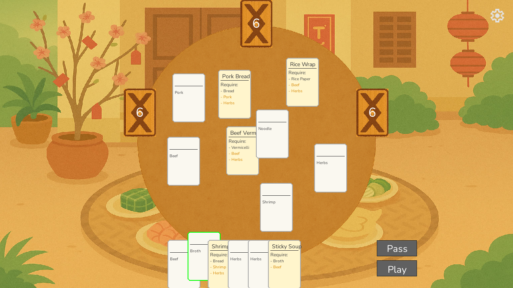

# Ebitengine Game Jam 2025

## Prerequisites

- [Go](https://go.dev/dl/) (version 1.24.3)
- [Taskfile](https://taskfile.dev/installation/) (optional)

## How to start

```bash
task run # requires Taskfile
```

or

```bash
go run cmd/main.go
```

or

```bash
task run-web # requires Taskfile
# And then open browser at http://localhost:8080
```

## HTML5 Build

<https://thanhfphan.itch.io/food-cards>

## Game Overview

Food Cards is a card game where players collect ingredient cards and combine them to create Vietnamese food recipes. The game features:

- Single-player mode against AI opponents
- Multiple recipe combinations
- Simple and intuitive UI
- Traditional Vietnamese food theme

## Screenshots




## Project Structure

```bash
.
├── cmd/main.go         # Main entry point
└── internal/           # Core game components
    ├── ai/             # AI logic for bot players
    ├── am/             # Asset management (images, sounds, fonts)
    ├── card/           # Card game mechanics and deck management
    ├── game/           # Core game logic and scene management
    ├── rules/          # Game rules and turn management
    ├── ui/             # UI components and rendering
    └── view/           # View models for rendering
```

## Assets Used

### Images

All images are generated by [ChatGPT](https://chat.openai.com/)

### Audio

1. **Card Select Sound**  
   [Link](https://freesound.org/people/soundfridgepr@gmail.com/sounds/669228/) — CC0 (No attribution required)

2. **Card Play Sound**  
   [Link](https://freesound.org/people/KaBlazik_Samples/sounds/553430/) – CC BY 4.0 (Attribution required)

3. **Recipe Made Sound**  
   [Link](https://freesound.org/people/JulesV4/sounds/615949/) – CC BY 4.0 (Attribution required)

4. **Background Music – Vietnam Bamboo Flute**  
   [Link](https://pixabay.com/music/world-vietnam-bamboo-flute-143601/) – Pixabay License (No attribution required)

### Font

- **Nunito**  
  [Google Fonts - Nunito](https://fonts.google.com/specimen/Nunito) – Open Font License

